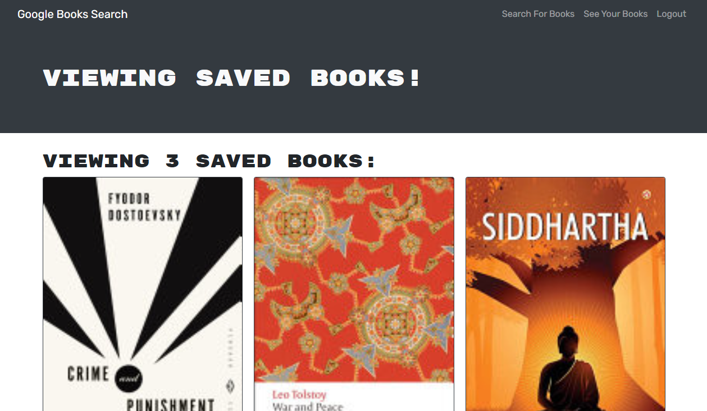

# Book Search Engine

## Description

Book search engine is a tool designed to allow a user to keep track of a reading list. Books can be searched by Google's books API, and added to a user's list. The project is built on the MERN stack, and uses GraphQL to handle database requests.

## Table of Contents

- [Installation](#installation)
- [Usage](#usage)
- [Questions](#questions)

## Installation

You can [visit the deployed webpage](https://cmseibel-book-search.herokuapp.com/).

## Usage

You should first sign up. You can then search for books, and add them to your reading list. You can view your reading list by clicking "view saved books", where you may remove books from your list.

## Questions

I can be found on GitHub [here](https://github.com/CameronMSeibel).
If you have any questions, I can be reached at cam.m.seib@gmail.com
